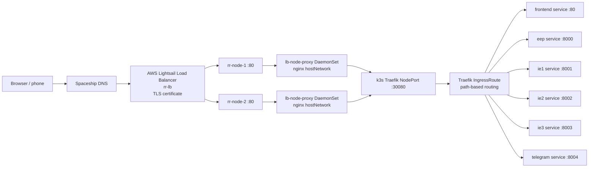
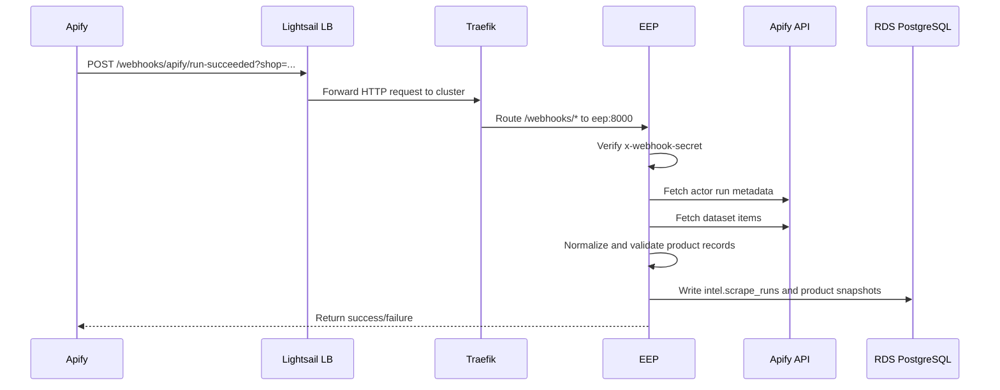
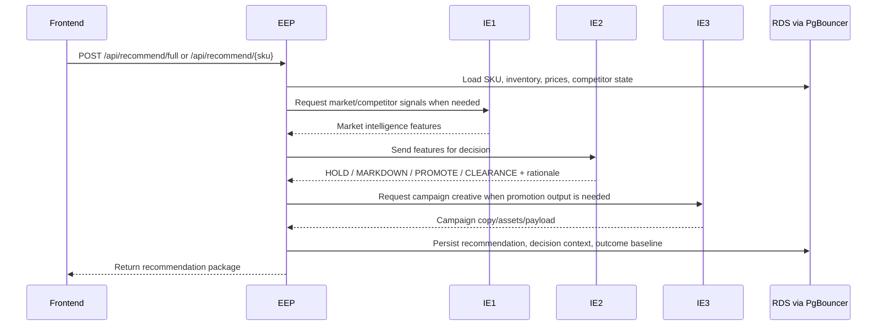

# Retail Radar AI Production Deployment Architecture

Last updated: June 8, 2026

This document explains the deployed Retail Radar AI production system: the cloud
servers, Kubernetes cluster, services, database path, load balancer, DNS/TLS,
CI/CD pipeline, Apify webhook ingestion, Telegram/Radar Assistant integration,
and how the EEP and IEP services communicate.

## Executive Summary

Retail Radar AI is deployed as a multi-service Kubernetes application on AWS
Lightsail using k3s. The public website is served through a Lightsail load
balancer and the custom domain `retailradar.site`. Inside the cluster, Traefik
routes requests by path to the frontend, EEP, IE1, IE2, IE3, and the Telegram
assistant service.

The system is intentionally split into independent services:

- `frontend`: browser-facing React/Vite single-page application.
- `eep`: the public API boundary and orchestration layer.
- `ie1`: market intelligence / competitor signal service.
- `ie2`: decision intelligence / rules and ML recommendation service.
- `ie3`: campaign creative / promotion generation service.
- `telegram`: Radar Assistant web chat and Telegram webhook service.
- `pgbouncer`: database connection pool in front of Amazon RDS PostgreSQL.
- `prometheus` and `grafana`: monitoring stack.

Kubernetes gives the deployment service discovery, rolling updates, health
checks, restart recovery, replica scheduling across two nodes, internal network
isolation, resource limits, and image-based release management.

## Current Cloud Inventory

### Domain and Public Entry Points

| Item | Value |
| --- | --- |
| Root domain | `retailradar.site` |
| Primary app domain | `www.retailradar.site` |
| Production login URL | `https://www.retailradar.site/login` |
| AWS Lightsail load balancer | `rr-lb` |
| Load balancer DNS | `e43c88ab0453c69b919ea0b68ffac616-860150828.eu-central-1.elb.amazonaws.com` |
| TLS certificate | Lightsail SSL/TLS certificate for `retailradar.site` and `www.retailradar.site` |
| DNS provider | Spaceship |

DNS is configured so `www.retailradar.site` points to the Lightsail load
balancer. The root domain is redirected to the `www` hostname. The load balancer
terminates HTTPS using the Lightsail certificate and forwards traffic to the
cluster nodes on port `80`.

### Lightsail Kubernetes Nodes

The k3s cluster currently has two Lightsail Ubuntu instances in Frankfurt
(`eu-central-1a`):

| Node | Role | Public IPv4 | Private IPv4 | Plan |
| --- | --- | --- | --- | --- |
| `rr-node-1` | k3s control-plane and etcd | `18.192.240.243` | `172.26.11.208` | 4 GB RAM, 2 vCPU, 80 GB SSD |
| `rr-node-2` | k3s worker | `18.185.239.195` | `172.26.7.42` | 4 GB RAM, 2 vCPU, 80 GB SSD |

Kubernetes node names:

| Kubernetes node | Role | Internal IP | OS | Runtime |
| --- | --- | --- | --- | --- |
| `ip-172-26-11-208` | `control-plane,etcd` | `172.26.11.208` | Ubuntu 24.04 LTS | containerd via k3s |
| `ip-172-26-7-42` | worker | `172.26.7.42` | Ubuntu 24.04 LTS | containerd via k3s |

The two-node layout is stronger than a single VM because most stateless
services run at least two replicas and can survive one pod restart or one node
having transient resource pressure. It is not full multi-AZ enterprise HA
because both instances are in the same Lightsail region/zone family and the
control plane is single-node, but it is a strong cost-conscious deployment for
the project.

### Database

The production database is Amazon RDS PostgreSQL. Application services do not
connect directly to RDS from every pod. Instead:

```text
Service pod -> pgbouncer service -> PgBouncer pod -> Amazon RDS PostgreSQL
```

PgBouncer is deployed inside Kubernetes with two replicas and exposes the
internal service `pgbouncer:6432`. The app `DATABASE_URL` in Kubernetes secrets
points to PgBouncer, while PgBouncer itself holds the real RDS host, port,
database, user, and password through `pgbouncer-secret`.

This is stronger than letting every pod open direct RDS connections because:

- PostgreSQL connection counts are limited.
- FastAPI workers and multiple replicas can otherwise exhaust RDS connections.
- PgBouncer reuses database connections and smooths bursts.
- PgBouncer-to-RDS TLS is enabled with `SERVER_TLS_SSLMODE=require`.

## High-Level Request Flow



The Lightsail load balancer can only forward to attached instances on ordinary
ports such as `80`. k3s Traefik exposes HTTP as NodePort `30080`, not directly
as host port `80`. The `lb-node-proxy` DaemonSet solves this:

1. It runs one nginx proxy pod on each node.
2. It uses `hostNetwork: true`.
3. It binds host port `80`.
4. It forwards requests to `127.0.0.1:30080`.
5. Traefik receives the request and applies the Kubernetes path routes.

This keeps the cloud load balancer simple while still letting Kubernetes own
the internal routing.

## Kubernetes Namespace and Main Resources

All application resources live in the namespace:

```text
retail-radar
```

The stack is defined in `infra/k8s/` and applied with:

```powershell
kubectl apply -k infra/k8s
```

The Kustomize entrypoint is `infra/k8s/kustomization.yaml`. It includes:

| File | Purpose |
| --- | --- |
| `00-namespace.yaml` | Creates the `retail-radar` namespace. |
| `00-config.yaml` | Non-secret environment configuration shared by services. |
| `10-pgbouncer.yaml` | PgBouncer deployment and service. |
| `20-backends.yaml` | EEP, IE1, IE2, IE3 deployments, services, HPAs/PDBs. |
| `30-frontend-telegram.yaml` | Frontend and Telegram assistant deployments/services. |
| `40-ingress.yaml` | Traefik middleware and path routing. |
| `50-monitoring.yaml` | Prometheus, Grafana, PVCs, services. |
| `60-lb-node-proxy.yaml` | nginx DaemonSet that bridges Lightsail LB port 80 to Traefik NodePort. |

## Live Kubernetes Deployment Shape

Current production deployments:

| Deployment | Replicas | Current image family | Purpose |
| --- | ---: | --- | --- |
| `frontend` | 2 | `ghcr.io/mhmd-jawad/retail-radar-frontend:<sha>` | React SPA served by nginx. |
| `eep` | 2 | `ghcr.io/mhmd-jawad/retail-radar-eep:<sha>` | Public API and orchestration layer. |
| `ie1` | 2 | `ghcr.io/mhmd-jawad/retail-radar-ie1:<sha>` | Market/competitor intelligence. |
| `ie2` | 2 min, 3 max | `ghcr.io/mhmd-jawad/retail-radar-ie2:<sha>` | Decision intelligence/rules/ML model. |
| `ie3` | 2 | `ghcr.io/mhmd-jawad/retail-radar-ie3:<sha>` | Campaign creative generation. |
| `telegram` | 1 | `ghcr.io/mhmd-jawad/retail-radar-telegram:<sha>` | Radar Assistant chat and Telegram integration. |
| `pgbouncer` | 2 | `edoburu/pgbouncer:latest` | Database connection pool. |
| `prometheus` | 1 | `prom/prometheus:v2.55.0` | Metrics collection. |
| `grafana` | 1 | `grafana/grafana:11.3.0` | Metrics dashboard. |
| `lb-node-proxy` | 1 per node | `nginx:1.27-alpine` | Host port 80 to Traefik NodePort bridge. |

Most stateless services run with two replicas and topology spread constraints
using `kubernetes.io/hostname`. This encourages Kubernetes to place pods across
both nodes. The live pod placement confirms the main services are distributed
between `ip-172-26-11-208` and `ip-172-26-7-42`.

## Internal Kubernetes Services

Kubernetes Services provide stable internal DNS names. Pods do not call each
other by pod IP; they call service names.

| Service | Port | Called by | Purpose |
| --- | ---: | --- | --- |
| `frontend` | 80 | Traefik | Serves the SPA. |
| `eep` | 8000 | Traefik, frontend via `/api`, other services | Public API/orchestrator. |
| `ie1` | 8001 | EEP, frontend health checks via `/ie1` | Market intelligence. |
| `ie2` | 8002 | EEP, frontend health checks via `/ie2` | Decision intelligence. |
| `ie3` | 8003 | EEP, Telegram assistant, frontend health checks via `/ie3` | Creative generation. |
| `telegram` | 8004 | Traefik, frontend via `/assistant-api` | Radar Assistant and Telegram webhook service. |
| `pgbouncer` | 6432 | EEP, IE services, Telegram | PostgreSQL connection pooling. |
| `prometheus` | 9090 | Grafana/admin access | Metrics store. |
| `grafana` | 3000 | Admin access | Monitoring UI. |

Kubernetes DNS examples:

```text
http://eep:8000/health
http://ie1:8001/health
http://ie2:8002/health
http://ie3:8003/health
http://telegram:8004/health
postgresql://...@pgbouncer:6432/...
```

## Path Routing

Traefik is the in-cluster HTTP router. The routing rules are defined in
`infra/k8s/40-ingress.yaml`.

| Public path | Internal service | Prefix behavior | Meaning |
| --- | --- | --- | --- |
| `/api/*` | `eep:8000` | Strip `/api` | Main frontend API calls. |
| `/assistant-api/*` | `telegram:8004` | Strip `/assistant-api` | Browser Radar Assistant chat API. |
| `/apify/*` | `eep:8000` | No strip | Alternative Apify webhook path. |
| `/webhooks/*` | `eep:8000` | No strip | Apify webhook receiver/replay endpoints. |
| `/webhook/telegram/*` | `telegram:8004` | No strip | Telegram bot webhooks. |
| `/ie1/*` | `ie1:8001` | Strip `/ie1` | Direct IE1 health/testing access. |
| `/ie2/*` | `ie2:8002` | Strip `/ie2` | Direct IE2 health/testing access. |
| `/ie3/*` | `ie3:8003` | Strip `/ie3` | Direct IE3 health/testing access. |
| `/*` | `frontend:80` | No strip | SPA routes such as `/login`, `/inventory`, `/assistant`. |

This path split is important because browser routes and backend routes share
one domain. For example:

```text
https://www.retailradar.site/login              -> frontend SPA
https://www.retailradar.site/inventory          -> frontend SPA
https://www.retailradar.site/api/inventory/items -> EEP /inventory/items
https://www.retailradar.site/assistant-api/chat -> Telegram assistant /chat
https://www.retailradar.site/ie2/health         -> IE2 /health
```

## Service Responsibilities

### Frontend

Location:

```text
frontend/
```

Container:

```text
ghcr.io/mhmd-jawad/retail-radar-frontend:<git-sha>
```

The frontend is a React/Vite single-page app served by nginx. It does not
directly connect to RDS or internal pods. It calls backend APIs through the
same public domain using path prefixes:

| Frontend base | Routes to |
| --- | --- |
| `/api` | EEP |
| `/ie1` | IE1 |
| `/ie2` | IE2 |
| `/ie3` | IE3 |
| `/assistant-api` | Telegram assistant |

The frontend is deployed with two replicas. Kubernetes can restart or replace
one frontend pod without taking the whole UI down.

### EEP: Experience / Execution / Orchestration Plane

Location:

```text
eep/
```

Container:

```text
ghcr.io/mhmd-jawad/retail-radar-eep:<git-sha>
```

EEP is the central public API and orchestration layer. It owns the main
business endpoints and coordinates calls to IE services. It is also the main
database writer for inventory, auth/shop state, outcomes, financial snapshots,
Apify ingest, recommendations, and dashboard summaries.

Main EEP route groups include:

| Route group | Purpose |
| --- | --- |
| `/auth/*` | Login, signup, logout, current user. |
| `/shop/*` | Shop profile and shop notifications. |
| `/admin/*` | Admin tenants, competitor requests, social accounts, campaigns, outcomes. |
| `/inventory/*` | Inventory CRUD, CSV import, stock movement, price patching. |
| `/recommend/*` | Full and batch recommendation orchestration. |
| `/decisions` | Records retailer decisions. |
| `/outcomes/*` | Outcome snapshots and measurement. |
| `/financial/*` | Balance sheet, profitability, cashflow, financial snapshots. |
| `/report`, `/report/live` | Report data for dashboard views. |
| `/dashboard/summary` | Dashboard summary cards. |
| `/webhooks/apify/*`, `/apify/webhook` | Apify competitor scrape ingestion. |
| `/social/accounts` | Tenant social account management. |
| `/system-decisions/*` | System decision sync and run inspection. |

EEP runs with two replicas and an HPA:

- minimum replicas: 2
- maximum replicas: 4
- CPU target: 70%

This gives EEP more resilience because it is the primary public API.

### IE1: Market Intelligence

Location:

```text
services/market_intelligence/
```

Container:

```text
ghcr.io/mhmd-jawad/retail-radar-ie1:<git-sha>
```

IE1 is the market intelligence service. It handles competitor/market signal
logic and contributes the external-market part of the decision pipeline. It is
kept as a separate service so competitor matching and market calculations do
not block or bloat EEP.

Kubernetes exposes it internally as:

```text
http://ie1:8001
```

The frontend can also hit it through:

```text
/ie1/*
```

for health and diagnostic calls, with Traefik stripping `/ie1`.

### IE2: Decision Intelligence

Location:

```text
services/decision_intelligence/
```

Container:

```text
ghcr.io/mhmd-jawad/retail-radar-ie2:<git-sha>
```

IE2 is the decision intelligence service. It contains the rules engine,
feature logic, model inference, and recommendation logic that decides whether a
SKU should be held, marked down, promoted, or cleared.

Kubernetes exposes it internally as:

```text
http://ie2:8002
```

IE2 has:

- readiness/liveness probes
- higher memory requests than IE1/IE3 because model inference is heavier
- HPA with min 2 and max 3 replicas
- PodDisruptionBudget with `minAvailable: 1`

This is strong because the highest-value intelligence service has explicit
scaling and disruption protection.

### IE3: Campaign Creative

Location:

```text
services/campaign_creative/
```

Container:

```text
ghcr.io/mhmd-jawad/retail-radar-ie3:<git-sha>
```

IE3 turns decisions into campaign output. It handles campaign creative,
promotion copy, social post payloads, and related creative generation logic.

Kubernetes exposes it internally as:

```text
http://ie3:8003
```

EEP calls IE3 when a recommendation needs a promotional/campaign artifact.
The Telegram assistant can also use campaign-generation logic through its own
tools and service integrations.

### Telegram Assistant / Radar Assistant

Location:

```text
services/telegram_assistant/
```

Container:

```text
ghcr.io/mhmd-jawad/retail-radar-telegram:<git-sha>
```

This service powers two related experiences:

1. Browser Radar Assistant through:

   ```text
   /assistant-api/chat -> telegram:8004 /chat
   ```

2. Telegram bot webhooks through:

   ```text
   /webhook/telegram
   /webhook/telegram/{tenant_id}
   ```

The service is intentionally deployed with one replica and `Recreate` rollout
strategy. That is important because Telegram polling/alert loops and bot
webhook side effects can double-send messages if two copies run at the same
time. In the current deployment, background polling and direct alert loops are
disabled by environment variables, while the HTTP chat and webhook endpoints
remain available.

## Database Schemas and Data Areas

The RDS PostgreSQL database is logically divided into schemas/data areas.
Important schema areas include:

| Area | Purpose |
| --- | --- |
| `core` | Retail tenants, stores, products, SKU variants, prices, inventory balances, inventory movements, sales, decisions. |
| `intel` | Competitor scrape runs, raw/normalized product snapshots, latest competitor product records. |
| Auth/shop tables | Users, sessions, tenants, shop profiles, competitor requests, notifications. |
| Marketing/social tables | Tenant social accounts and webhook registration metadata. |
| Financial tables | Financial snapshots, balance sheet/profitability/cashflow configuration and progress. |
| Outcome tables | Recommendation snapshots and measured outcomes. |

EEP is the main service that initializes and writes most of these tables. IE
services read inputs or generate outputs used by EEP. PgBouncer protects RDS
from connection spikes.

## Apify Webhook and Competitor Intelligence Flow

The Apify integration is handled by EEP.

Primary endpoints:

```text
POST /webhooks/apify/run-succeeded?shop=SHOP_CODE
POST /apify/webhook?shop=SHOP_CODE
POST /webhooks/apify/replay-run?shop=SHOP_CODE&run_id=RUN_ID
```

Expected security header:

```text
x-webhook-secret: <configured secret>
```

Flow:



The ingest code extracts the Apify actor run id from common webhook payload
shapes, downloads the default dataset, normalizes the products, and writes the
run plus snapshots into the database. This makes the competitor data pipeline
event-driven: Apify runs externally, then calls the project when a scrape
finishes.

The old deployment docs mention a legacy webhook box. The Kubernetes stack now
also exposes the Apify webhook path through the main domain. If any Apify actor
is still configured to call the old legacy URL, it can keep working separately.
For the current Kubernetes production path, configure Apify to call the
`www.retailradar.site` webhook URL.

## Recommendation / Decision Flow

The main decision flow is coordinated by EEP:



This separation is stronger than one monolithic process because:

- IE1, IE2, and IE3 can be scaled independently.
- A failure in campaign generation does not have to take down inventory CRUD.
- EEP remains the single API boundary and data consistency layer.
- The model-heavy IE2 service gets its own resource requests and HPA.

## Inventory Import Flow

CSV import is a frontend-to-EEP workflow:

1. User uploads or pastes CSV rows in the Inventory page.
2. Frontend parses CSV into typed inventory rows.
3. Frontend sends:

   ```text
   POST /api/inventory/import
   ```

4. Traefik strips `/api`.
5. EEP receives:

   ```text
   POST /inventory/import
   ```

6. EEP validates `InventoryImportPayload`.
7. EEP upserts products, SKU variants, current retail prices, suppliers,
   inventory balances, inventory movement records, and audit rows.
8. EEP writes through PgBouncer to RDS.

This recently surfaced a production schema mismatch: code referenced
`core.prices.amount_usd`, while the actual schema uses `core.prices.amount`.
The fix was deployed in the EEP image. The incident is a good example of why
logs, rollout control, and per-service deployments matter: only EEP needed to
be patched and rolled forward.

## Authentication and Tenant Isolation

The frontend uses EEP auth endpoints:

```text
POST /api/auth/login
POST /api/auth/signup-shop
GET  /api/auth/me
POST /api/auth/logout
```

EEP resolves tenant/shop context from the request/session and passes tenant
context into database functions. Inventory, decisions, outcomes, social
accounts, and admin views are tenant-aware. The default deployed tenant/store
configuration is:

```text
RETAIL_TENANT_SLUG=default
RETAIL_STORE_CODE=MAIN
```

Admin routes exist for tenant review, shop onboarding, competitor requests,
social account management, campaign overview, financial overview, and outcome
aggregation.

## Monitoring

Monitoring runs inside the same Kubernetes namespace:

| Component | Purpose |
| --- | --- |
| Prometheus | Scrapes service metrics and stores time series. |
| Grafana | Visualizes Prometheus metrics. |

Prometheus currently scrapes:

```text
eep:8000/metrics
ie2:8002/metrics
```

Grafana is single-replica with a persistent volume. Prometheus is also
single-replica with a persistent volume and a 7-day retention configuration.

The monitoring stack is intentionally internal. It should not be exposed
publicly without authentication and network controls.

## Secrets and Configuration

Kubernetes separates non-secret config from secrets:

| Resource | Type | Purpose |
| --- | --- | --- |
| `retail-config` | ConfigMap | Non-secret values such as service URLs, tenant slug, store code, token TTL. |
| `retail-secrets` | Secret | App secrets such as database URL, API keys, webhook secrets, JWT/admin secrets. |
| `pgbouncer-secret` | Secret | Real RDS host/user/password for PgBouncer. |
| `ghcr-creds` | Docker registry secret | Allows k3s to pull private GHCR images. |

The repo intentionally does not commit real secret values. Secrets are created
imperatively on the cluster or injected through GitHub Actions secrets.

GitHub Actions secrets used by CI/CD include:

| Secret | Purpose |
| --- | --- |
| `GHCR_TOKEN` | Push Docker images to GitHub Container Registry. |
| `BOX_B_HOST` | SSH host for the k3s deployment server. |
| `BOX_B_USER` | SSH user for deploy. |
| `BOX_B_SSH_KEY` | Private key used by GitHub Actions to SSH into the server. |
| `VITE_API_KEY`, `VITE_GRAFANA_URL` | Optional frontend build-time values. |

## CI/CD Pipeline

The deployment workflow is:

```text
.github/workflows/deploy.yml
```

It runs on:

- push to `dev`
- push to `main`
- manual workflow dispatch

Jobs:

1. `Test`
   - checks out the repo
   - installs Python dependencies
   - runs unit tests
   - builds the frontend

2. `Build and Push Images`
   - runs only after tests pass
   - builds Docker images for EEP, IE1, IE2, IE3, frontend, Telegram assistant
   - tags images with the short git SHA
   - pushes images to GHCR

3. `Deploy to Production k3s`
   - runs only on `main`
   - pins all app images in `infra/k8s/kustomization.yaml` to the built SHA
   - copies Kubernetes manifests to the server over SSH
   - applies manifests with `kubectl apply -k`
   - waits for rollouts
   - checks health endpoints

This is stronger than manual deployment because production only changes after
tests pass and image builds succeed. The short-SHA image tag makes every
deployment traceable to a Git commit.

## Why Kubernetes Helps Here

Kubernetes is not just a container launcher in this system. It provides several
concrete production benefits:

### Stable Internal Networking

Each service has a stable DNS name (`eep`, `ie1`, `ie2`, `ie3`, `telegram`,
`pgbouncer`) even though pods are replaced and get new pod IPs.

### Rolling Updates

When a new image tag is deployed, Kubernetes creates new pods, waits for
readiness probes, then removes old pods. This reduces downtime and lets one
service be rolled without restarting the entire platform.

### Health Checks and Self-Healing

Readiness probes stop traffic from going to pods that are not ready. Liveness
probes restart pods that become unhealthy.

### Replication

Frontend, EEP, IE1, IE2, IE3, and PgBouncer all run multiple replicas. If one
pod dies, Kubernetes starts another. If one pod is temporarily unavailable,
Services can route to another ready pod.

### Scheduling Across Nodes

Topology spread constraints encourage pods to be distributed across both
Lightsail nodes. This improves resilience compared with putting every replica
on one VM.

### Resource Control

CPU and memory requests/limits protect the small nodes from one service
consuming everything. IE2 gets larger memory limits because it is model-heavy;
frontend gets tiny limits because nginx is lightweight.

### Separation of Concerns

Each service owns a distinct responsibility. Kubernetes lets the platform run
as a real microservice system while keeping one public domain and one routing
layer.

## Why This Deployment Is Strong

The deployment is strong for a small-to-mid-size production project because:

- It uses cloud infrastructure rather than localhost or a single Docker Compose
  stack on one machine.
- It has two Kubernetes nodes instead of one machine holding every process.
- It has a real cloud load balancer in front of the cluster.
- It uses HTTPS on the custom domain through a managed certificate.
- It uses path-based routing so one domain can cleanly serve UI, APIs, webhooks,
  and assistant endpoints.
- It keeps database credentials and registry credentials in Kubernetes/GitHub
  secrets, not committed source.
- It uses PgBouncer to protect RDS from connection exhaustion.
- It uses multiple replicas for stateless services.
- It has readiness/liveness probes.
- It has HPAs for EEP and IE2.
- It has monitoring through Prometheus and Grafana.
- It uses CI/CD to build immutable images and deploy SHA-pinned versions.
- It can patch one service independently, as happened with the EEP inventory
  import fix.

## Known Limits and Improvement Areas

This is a solid project deployment, but it is not yet enterprise-grade HA. The
main known limits are:

- The k3s control plane is single-node (`rr-node-1`). If that node fails, the
  existing workloads may continue briefly, but cluster management is impaired.
- Lightsail nodes are small; heavy model or scraping spikes can hit capacity.
- Prometheus and Grafana use local-path persistent volumes, so their data is not
  highly available.
- Grafana/Prometheus should remain internal or protected before public exposure.
- EEP public routes should add explicit rate limiting for `/auth/*`,
  `/recommend/*`, and webhook endpoints.
- CI/CD deploy reliability should be watched until the GitHub deploy job is
  consistently green.
- The root domain redirect is handled by DNS provider redirect logic, while the
  app is primarily served at `www.retailradar.site`.

## Operational Commands

Useful production checks:

```powershell
kubectl get nodes -o wide
kubectl -n retail-radar get pods -o wide
kubectl -n retail-radar get deploy
kubectl -n retail-radar get svc
kubectl -n kube-system get svc traefik
```

Check rollouts:

```powershell
kubectl -n retail-radar rollout status deployment/eep
kubectl -n retail-radar rollout status deployment/frontend
kubectl -n retail-radar rollout status deployment/ie1
kubectl -n retail-radar rollout status deployment/ie2
kubectl -n retail-radar rollout status deployment/ie3
kubectl -n retail-radar rollout status deployment/telegram
```

Check logs:

```powershell
kubectl -n retail-radar logs deployment/eep --tail=200
kubectl -n retail-radar logs deployment/ie1 --tail=200
kubectl -n retail-radar logs deployment/ie2 --tail=200
kubectl -n retail-radar logs deployment/ie3 --tail=200
kubectl -n retail-radar logs deployment/telegram --tail=200
```

Check public health:

```powershell
Invoke-WebRequest https://www.retailradar.site/api/health -UseBasicParsing
Invoke-WebRequest https://www.retailradar.site/ie2/health -UseBasicParsing
Invoke-WebRequest https://www.retailradar.site/assistant-api/health -UseBasicParsing
```

Manual emergency image rollout example:

```powershell
kubectl -n retail-radar set image deployment/eep eep=ghcr.io/mhmd-jawad/retail-radar-eep:<sha>
kubectl -n retail-radar rollout status deployment/eep --timeout=180s
```

## End-to-End Mental Model

Think of the platform as five layers:

1. **Public edge**
   - Spaceship DNS
   - Lightsail load balancer
   - TLS certificate

2. **Cluster ingress**
   - nginx `lb-node-proxy` on every node
   - k3s Traefik
   - path-based IngressRoute

3. **Application services**
   - frontend
   - EEP
   - IE1
   - IE2
   - IE3
   - Telegram assistant

4. **Data and integrations**
   - PgBouncer
   - Amazon RDS PostgreSQL
   - Apify API/webhooks
   - Telegram API/webhooks
   - optional LLM/social platform APIs through secrets

5. **Operations**
   - GitHub Actions
   - GHCR images
   - Kubernetes rollouts
   - Prometheus/Grafana monitoring

The strongest architectural choice is that EEP is the controlled public API
orchestrator, while the IEP services are separated behind Kubernetes service
discovery. The browser never needs direct database access, and the database is
protected behind PgBouncer. The load balancer and Traefik give a single public
domain while Kubernetes keeps the internal service graph clean and replaceable.
